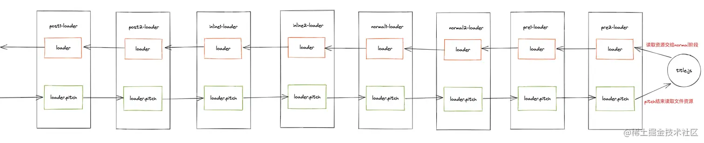

# Mini-Webpack

## 介绍

webpack 原理学习项目，实现简易 webpack 及其相关工具链，并搭配相关教程。

- 实现基本打包模块 ✅
- 实现 run-loader 模块支持 loader 运行 ✅
- 实现基本 webpack plugin 钩子 ✅
- 实现简易 tapable ❌
- 实现 plugin-demo ❌
- 实现 loder-demo ❌
- 完整 mini-webpack 搭建教程 ❌

## 基本流程


- 初始化参数阶段。 
  - 这一步会从我们配置的webpack.config.js中读取到对应的配置参数和shell命令中传入的参数进行合并得到最终打包配置参数。
- 开始编译准备阶段 
  - 这一步我们会通过调用webpack()方法返回一个compiler方法，创建我们的compiler对象，并且注册各个Webpack Plugin。找到配置入口中的entry代码，调用compiler.run()方法进行编译。
- 模块编译阶段 
  - 从入口模块进行分析，调用匹配文件的loaders对文件进行处理。同时分析模块依赖的模块，递归进行模块编译工作。
- 完成编译阶段 
  - 在递归完成后，每个引用模块通过loaders处理完成同时得到模块之间的相互依赖关系。
- 输出文件阶段 
  - 整理模块依赖关系，同时将处理后的文件输出到ouput的磁盘目录中。

### 初始化参数

- 合并命令行 cli 参数与配置文件参数

### 编译准备

- 通过参数创建compiler对象。我们看到官方案例中通过调用webpack(options)方法返回的是一个compiler对象。并且同时调用compiler.run()方法启动的代码进行打包。 
  - 初始化 options rootPath hooks
- 注册我们定义的webpack plugin插件。 
  - run 时注册插件
- 根据传入的配置对象寻找对应的打包入口文件。
  - 解析打包入口 options.entry

### 模块编译

- 根据入口文件路径分析入口文件，对于入口文件进行匹配对应的loader进行处理入口文件。
- 将loader处理完成的入口文件使用 webpack 进行编译。
- 分析入口文件依赖，重复上边两个步骤编译对应依赖。
- 如果嵌套文件存在依赖文件，递归调用依赖模块进行编译。
- 递归编译完成后，组装一个个包含多个模块的 chunk

1.从 entry 出发编译每一个入口文件 buildModule方法 
- buildModule接受两个参数进行模块编译，第一个为模块所属的入口文件名称，第二个为需要编译的模块路径。
2.获取模块源代码并使用loader进行处理
3.进行依赖处理
- 从入口出发，解析 entry 为 module 使用 babel 解析 ast 并遍历将 require 替换为 webpack_require
  - 放入 entries 数组
- 处理 require 中的路径转为 相对与 rootPath 的相对路径 并进行模块处理
  - 放入 modules 数组

### 编译完成阶段

- 将每个 entry 分成多个 chunck 
  - name:当前入口文件的名称 
  - entryModule: 入口文件编译后的对象。 
  - modules: 该入口文件依赖的所有模块对象组成的数组，其中每一个元素的格式和entryModule是一致的。

### 输出文件阶段

- 根据 chunk 输出目标文件，一个chunk输出一个文件，使用 getSourceCode 利用webpack 代码模板输出


### 拓展

- 别名支持
- treeShaking支持
- 环境变量支持（配置转为函数导出，使用 node cross-env）

## Loader

- loader就是一个函数，通过它我们可以在webpack处理我们的特定资源(文件)之前进行提前处理。

### Loader 配置

```js
module.exports = {
  module: {
    resolveLoader: {
      // 可以使用 loader 配置别名
      // 默认在 node_modules 中查找
      alias: {
        'babel-loader': path.resolve(__dirname,'../loaders/babel-loader.js')
      },
      // 定义查找 loader 的目录
      modules: [ path.resolve(__dirname,'../loaders/') ]
    },
    rules: [
      // test 为匹配后缀
      // use 为使用的字符串
      // enforce 为 loader 加载顺序      
      { test: /.css$/, use: 'sass-loader', enforce: 'pre' },
      { test: /.css$/, use: 'css-loader' },
      { test: /.css$/, use: 'style-loader', enforce: 'post' },
      {
        test:/\.js$/,
        loader: 'babel-loader'
      }
    ],
  },
};
```

### Loader 执行顺序

enforce有两个值分别为pre、post
- 当我们的rules中的规则没有配置enforce参数时,默认为normal loader(默认loader)。
- 当我们的rules中的规则配置enforce:'pre'参数时,我们称之它为pre loader(前置loader)。
- 当我们的rules中的规则配置enforce:'post'参数时,我们称之它为post loader(后置loader)。


- 内联的方式配置loader
  - 执行顺序从右向左
  - 以 modules! 为最右
  - 以 ! 分割 loader
- 可以禁用正常配置中的 loader
  - https://webpack.js.org/concepts/loaders/#inline

```js
import Styles from 'style-loader!css-loader?modules!./styles.css';
```


### Loader 执行阶段
pitch 阶段和 nomral 阶段
- 在处理资源文件之前，首先会经历pitch阶段。
- pitch结束后，读取资源文件内容。
- 经过pitch处理后，读取到了资源文件，此时才会将读取到的资源文件内容交给正常阶段的loader进行处理。



- loader的执行阶段实际上分为两个阶段，webpack在使用loader处理资源时首先会经过loader.pitch阶段，pitch阶段结束后才会读取文件而后进行normal阶段处理。
- Pitching 阶段: loader 上的 pitch 方法，按照 后置(post)、行内(inline)、普通(normal)、前置(pre) 的顺序调用。
- Normal 阶段: loader 上的 常规方法，按照 前置(pre)、普通(normal)、行内(inline)、后置(post) 的顺序调用。


- loader 熔断效果
  - 某一个loader的pitch阶函数中返回一个非undefined的值就会发生熔断的效果


### 编写 Loader

#### 同步 Loader
```js
// 同步loader
// source 为需要处理文件的 源代码 string
function loader(source) {
    // ...
    // 一系列同步逻辑 最终函数返回处理后的结果交给下一个阶段
  
    // normal loader 重化工
    // this.getOptions()
  
    // 返回处理过的代码并传递给下一 Lodaer
    return source
}

// row 属性设置为 true 可以将 source 转为 Buffer 类型
// 处理图片等资源使用
loader.row = true

// pitch阶段的同步同理
loader.pitch = function (remainingRequest, previousRequest, data) {
    // 一系列同步操作 函数执行完毕则pitch执行完毕
}
```

- remainingRequest
  - remainingRequest表示剩余需要处理的loader的绝对路径以!分割组成的字符串
- previousRequest
  - 表示pitch阶段已经迭代过的loader按照!分割组成的字符串
- data
  - 给 data 赋予属性，可以在 normal loader 中使用 this.data.xxx 调用

#### 异步 Loader
```js
function asyncLoader1() {
    // dosomething
    return Promise((resolve) => {
        setTimeout(() => {
            // resolve的值相当于同步loader的返回值
            resolve('19Qingfeng')
        },3000)
    })
}

function asyncLoader2() {
  const callback = this.async()
  // dosomething
  // 调用callback告诉loader-runner异步loader结束
  callback('19Qingfeng')
}
```

### LoaderRunner


#### runLoader 方法

入参

- resource: resource参数表示需要加载的资源路径。
- loaders: 表示需要处理的loader绝对路径拼接成为的字符串，以!分割。
- context: loader上下文对象，webpack会在进入loader前创建一系列属性挂载在一个object上，而后传递给loader内部。
  - loader 中使用的 this
- processResource: 读取资源文件的方法。
  - 同样源码中的processResource涉及了很多plugin hooks相关逻辑，这里你可以简单理解为它是一个fs.readFile方法就可以。本质上这个参数的核心就是通过processResource方法按照路径来读取我们的资源文件。

回调入参

- error: 如果runLoaders函数执行过程中遇到错误那么这个参数将会变成错误内容，否则将为null。
- result: 如果runLoaders函数执行完毕并且没有存在任何错误，那么这个result将会存在以下属性:
  - result：它是一个数组用来表示本次经过所有loaders处理完毕后的文件内容。
  - resourceBuffer： 它是一个Buffer内容，这个内容表示我们的资源文件原始内容转化为Buffer的结果。
  - 其他参数是关于webpack构建与缓存时的参数，这里我们可以先不用关系这些参数。


#### CSS LOADER

```js
// css-loader源码（经简化）
// https://github.com/webpack-contrib/css-loader/blob/master/src/index.js
import postcss from 'postcss';

module.exports = async function (content, map, meta) {
  const options = this.getOptions(); // 获取配置

  const plugins = []; // 转译源码所需的postcss插件
  shouldUseModulesPlugins(options, this) && plugins.push(modulesPlugins); // 处理css-modules
  shouldUseImportPlugin(options, this) && plugins.push(importPlugin); // 处理@import语句
  shouldUseURLPlugin(options, this) && plugins.push(urlPlugin); // 处理url()语句
  shouldUseIcssPlugin(options, this) && plugins.push(icssPlugin); // 处理icss相关逻辑

  if (meta && meta.ast) { // 复用前面loader生成的CSS AST（如postcss-loader）
    content = meta.ast.root;
  }

  const result = await postcss(plugins).process(content); // 使用postcss转译源码

  const importCode = getImportCode(); // 需要导入的依赖语句
  const moduleCode = getModuleCode(result); // 模块导出内容
  const exportCode = getExportCode(); // 其他需要导出的信息，如css-modules的类名映射等

  const callback = this.async(); // 异步返回
  callback(null, `${importCode}${moduleCode}${exportCode}`);
};
```

## Plugin

## Tapable

- 提供了一系列事件的发布订阅 API
- 官方提供 9 种钩子

```js
const {
	SyncHook,
	SyncBailHook,
	SyncWaterfallHook,
	SyncLoopHook,
	AsyncParallelHook,
	AsyncParallelBailHook,
	AsyncSeriesHook,
	AsyncSeriesBailHook,
	AsyncSeriesWaterfallHook
 } = require("tapable");
```

### 分类

- 同步表示注册的事件函数会同步进行执行。
  - 针对同步钩子来 tap 方法是唯一的注册事件的方法，通过 call 方法触发同步钩子的执行。 
  - 异步钩子可以通过 tap、tapAsync、tapPromise三种方式来注册，同时可以通过对应的 call、callAsync、promise 三种方式来触发注册的函数。
- 异步表示注册的事件函数会异步进行执行。
  - 

